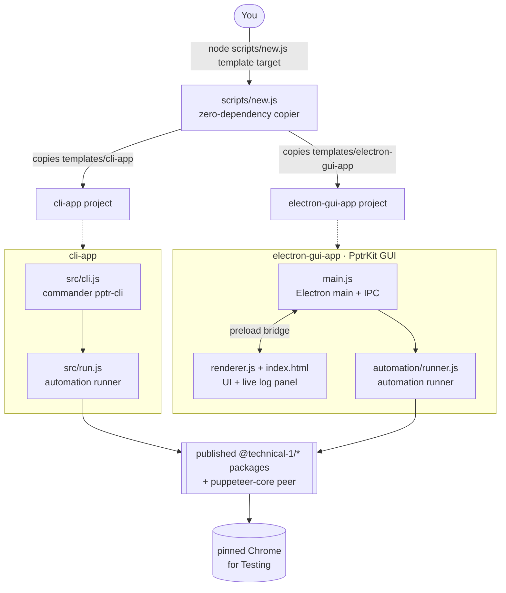

# Architecture

At its heart this repo is simple: a tiny scaffolder plus a set of self-contained templates. You pick a template, the scaffolder copies it into a new folder, and you're left with a normal project that installs the published `@technical-1` packages from npm and composes them into a working browser automation.

## System Diagram

## Component Descriptions

### Scaffolder
- **Purpose**: Turn a template directory into a fresh, ready-to-run project.
- **Location**: `scripts/new.js`
- **Key responsibilities**: List the templates under `templates/`, validate the requested one, refuse to overwrite a non-empty target, and copy the template while skipping `node_modules`, `dist`, `chrome-local`, and `.git`. It has zero runtime dependencies — just Node's `fs` and `path` — so there is nothing to install before you scaffold.

### cli-app template
- **Purpose**: A headless command-line automation you can drop into scripts and CI.
- **Location**: `templates/cli-app/`
- **Key responsibilities**: `src/cli.js` defines the `pptr-cli` command with [commander](https://www.npmjs.com/package/commander) (URL argument plus `--no-headless`, `--stealth`, `--fingerprint`, `--screenshot <dir>` flags) and maps success/failure to exit codes `0`/`1`. `src/run.js` is the automation runner that composes the suite around an injected logger.

### electron-gui-app template (PptrKit GUI)
- **Purpose**: A desktop front end for the same automation, for people who'd rather click than type flags.
- **Location**: `templates/electron-gui-app/`
- **Key responsibilities**: `main.js` runs the Electron main process, owns the `run-automation` and `pick-screenshot-dir` IPC handlers, and streams each log line to the window. `preload.js` exposes a minimal, allow-listed `window.api` bridge. `renderer.js` + `index.html` render the form and the live log panel. `automation/runner.js` holds the shared automation logic. `electron-builder` config in `package.json` produces installers for macOS, Windows, and Linux.

### Automation runners
- **Purpose**: The one file you actually edit to build your automation.
- **Location**: `templates/cli-app/src/run.js`, `templates/electron-gui-app/automation/runner.js`
- **Key responsibilities**: Resolve a Chrome executable, launch a browser via `withBrowser`, optionally apply stealth and a randomized fingerprint, navigate, run the marked `your automation here` block, and optionally capture a full-page screenshot. Both accept an injectable dependency object as a test seam so the suite can be mocked in unit tests.

## Data Flow

1. You run `node scripts/new.js <template> <target-dir>`; the scaffolder copies the chosen template into the new directory and prints the next commands.
2. You `pnpm install` in the new project, pulling the `@technical-1` packages and `puppeteer-core` from npm.
3. **CLI:** `pnpm start <url> [flags]` parses arguments in `cli.js`, calls `run()`, which composes the suite and drives Chrome; logs print to the console and the process exits `0` or `1`.
4. **GUI:** you launch the app, fill in a URL and toggles, and click Launch; the renderer calls `window.api.runAutomation()`, the preload bridge forwards it over IPC, `main.js` invokes the runner, and log lines stream back to the panel in real time.

## External Integrations

| Service | Purpose | Notes |
|---------|---------|-------|
| npm (`@technical-1/*`) | The published package suite the templates compose | Installed at scaffold time; each package does one job and shares a typed error model and injectable logger |
| Chrome for Testing | The actual browser the automation drives | A pinned build is downloaded on first run (CLI) or bundled into the installer (GUI); driven through `puppeteer-core` |
| GitHub Actions | CI and releases | Per-template test matrix plus an Electron packaging smoke test; tag-driven release builds installers for Windows and Linux |

## Key Architectural Decisions

### A dependency-free scaffolder
- **Context**: The whole point is a fast start. Anything you'd have to install *before* you can scaffold works against that.
- **Decision**: Write `scripts/new.js` using only Node built-ins (`fs.cpSync` with a skip filter) — no CLI framework, no template engine.
- **Rationale**: A generator that itself needs `npm install` first adds friction and a dependency to keep patched. A plain file copy is instant, has nothing to break, and is trivial to read and trust.

### Templates consume published packages, not vendored source
- **Context**: The templates need the automation building blocks, and those blocks evolve independently.
- **Decision**: Each template declares the `@technical-1/*` packages as normal npm dependencies (with `puppeteer-core` as the browser-driver peer) instead of copying their source into the repo.
- **Rationale**: Scaffolded projects get real, versioned, updatable dependencies — `pnpm update` just works. Vendoring would freeze the code and turn every suite improvement into a manual copy-paste. `docs/using-the-suite.md` shows how to `link:` a local checkout when you want to iterate on both at once.

### One editable runner, isolated behind a marked block
- **Context**: Users should customize behavior without learning the launch/navigate/screenshot plumbing.
- **Decision**: Concentrate all the boilerplate in a runner and leave a single clearly-marked `your automation here` block for user code.
- **Rationale**: The 90% case — "open this page and do something" — becomes a few lines in an obvious spot, while the browser lifecycle, logging, and screenshot handling stay handled and out of the way.

### Electron security done properly
- **Context**: A desktop app that drives a browser has a real attack surface if the renderer can reach Node directly.
- **Decision**: Turn on `contextIsolation`, keep `nodeIntegration` off, and expose only an allow-listed `window.api` from `preload.js`; all privileged work happens in the main process behind named IPC handlers.
- **Rationale**: The UI can request exactly two things — run an automation, pick a screenshot folder — and nothing else. This follows Electron's recommended security model rather than the convenient-but-dangerous shortcut of a fully-privileged renderer.

### Unsigned builds by default, graceful notarization skip
- **Context**: Contributors should be able to produce a working desktop build without owning an Apple Developer certificate.
- **Decision**: Set `mac.identity: null` so `electron-builder` skips code-signing, and have `scripts/notarize.js` no-op when `APPLE_ID` isn't set instead of throwing.
- **Rationale**: The build completes for everyone out of the box. Signing and notarization become an opt-in you enable by supplying real credentials — the pipeline is ready, it just waits for secrets rather than failing without them.
